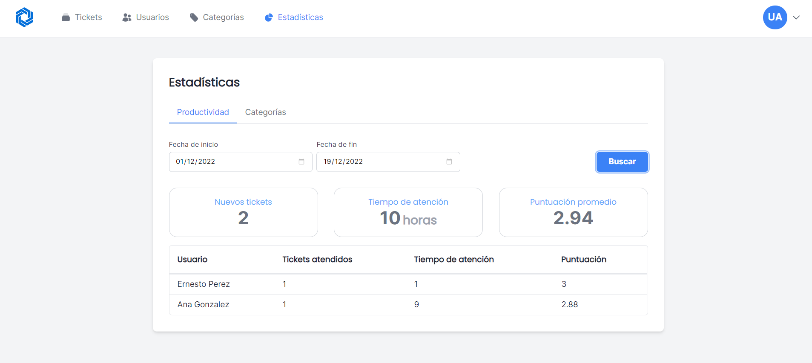

  
  <h1 align="center">Wise Support</h1>
  

    
  

  

    Support ticket management system created with TypeScript, Express and React.
  

See the [Spanish version](README.es.md) of this file.

## Preview

_Light mode_

_Dark mode_

_Statistics_

_Settings_

## Description

Wise Support is a system focused on the management of support tickets that are generated within a company, with the aim of monitoring the level of productivity of each of the support agents over time based on the completed tickets. The application offers the following functionalities:

-   User management.
-   Ticket management.
-   Category management.
-   Task management associated with tickets.
-   Statistics.

The system handles three user roles:

-   **Administrator**: has access to all system functionalities.
-   **Supervisor**: assigns tickets to support users and tracks assigned tickets. In addition, it can see the productivity statistics of support users.
-   **Agent** (support user): handles the tickets assigned by the supervisor and registers the tasks performed to solve the tickets.

## Structure

The repository has two components:

-   Backend that contains the API of the project (located in the `server` directory).
-   Frontend that contains the SPAs of the project (located in the `client` directory).

## Features

-   User management.
-   Statistics.
-   Authentication and role-based access control.
-   Use of migrations for database administration.
-   Responsive and accessible design.

### What's missing?

-   Internationalization.
-   Better accessibility.
-   Unit/Integration tests.

## Technologies

-   The solution was developed using TypeScript using Node.js version 16, and is managed using NPM Workspaces.
-   **Backend**: Express.js and Prisma (ORM).
-   **Frontend**: React.js and Tailwind CSS.
-   PostgreSQL.
-   JWT (JSON Web Tokens).
-   Jest.
-   ESLint and Prettier.

## Quick Start

1. Install PostgreSQL and create a database called `wise_support`.

2. Clone the repository.

3. Install the Node.js dependencies by running `npm install` command in the root of the project.

4. Set environment variables within the `server` project. You must create a `.env` file in the root directory of the project and configure all the variables described in the `.env.example` file (see [Environment Variables Configuration](#environment-variables-configuration)).

5. Run the database migrations by running the `npm run db:restore` command in the root of the project (see [Database Management](#database-management)).

### Environment Variables Configuration

1. `client` project environment variables:

    | Environment Variable        | Description                                                                                |
    | --------------------------- | ------------------------------------------------------------------------------------------ |
    | `REACT_APP_API_URL`         | Base URL of the API (the server's base URL must have the format `https://www.example.com`) |
    | `REACT_APP_AUTH0_DOMAIN`    | Auth0 domain                                                                               |
    | `REACT_APP_AUTH0_CLIENT_ID` | Auth0 client ID                                                                            |

    > In production, it is necessary to set the environment variables on the server where the application will be deployed, since the environment variables are not read from the `.env` file in production.

2. `server` project environment variables:

    | Environment Variable       | Description                                                                                                  |
    | -------------------------- | ------------------------------------------------------------------------------------------------------------ |
    | `SERVER_PORT`              | Port number to listen for HTTP requests                                                                      |
    | `SERVER_BASE_URL`          | Base path where the server is located (defaults to the root path)                                            |
    | `CORS_ORIGIN`              | Allowed origin for CORS (defaults to all origins `*`)                                                        |
    | `JWT_ACCESS_TOKEN_SECRET`  | Secret key used to generate and verify the JWT access tokens (required variable)                             |
    | `JWT_REFRESH_TOKEN_SECRET` | Secret key used to generate and verify JWT refresh tokens (required variable)                                |
    | `DATABASE_URL`             | PostgreSQL database connection string (see [Prisma](https://pris.ly/d/connection-strings) documentation)     |
    | `KNOWLEDGE_BASE_URL`       | URL of the external knowledge base                                                                           |
    | `KMS_CRYPTO_KEY_ID`        | Path to the cryptography key used to encrypt sensitive data (see [Google KMS](https://cloud.google.com/kms)) |
    | `KMS_CREDENTIALS`          | Base64-encoded JSON credentials of the Google Cloud service account used to access Google KMS                |

    > In production, it is necessary to set the environment variables on the server where the application will be deployed, since the environment variables are not read from the `.env` file in production.

### Database Management

_Database administration is handled inside the `server` directory._

To run database migrations, the `npx prisma migrate dev` (or `npm run db:restore`) command must be executed.

To generate a new migration, the `npx prisma migrate dev --name <name>` command must be executed (use the `migration_name` format). To skip test data, the `--skip-seed` option must be added to the command (this option is recommended when making a change to the data model that may affect the test data generated with the `seed` command).

In order to restore/reset the database, the `npx prisma migrate reset` command must be executed. This command will remove all existing data from the database and recreate the database along with the test data.

To add test data to the database, the `npx prisma db seed` command must be executed. This command runs automatically when a database is restored or a new migration is generated.

> When modifying the database schema, the `npx prisma generate` command must be executed in order to update the Prisma ORM files. When installing Node.js dependencies or restoring the database, the `npx prisma generate` command is executed automatically.

## Development

Run the `npm start` command in the root of the project. This will start both the server and the web application of the project.

These are the credentials of the administrator user account:

-   **Email**: `admin@test.com`
-   **Password**: `admin123`

## Deployment

To deploy the client application to production, you must run the `npm run build` command at the root of the `client` directory. This will generate a `build` folder, which contains the static files of the web application.

To deploy the server to production, you must run the `npm run build` command at the root of the `server` directory. This will generate a `build` folder, which contains the compiled files of the server. Prior to running the server, we need to set up the PostgreSQL database instance and environment variables on the production server, as well as the `npm run db:restore` command to restore the database. To start the server in production, the `npm start:production` command must be run at the root of the `server` directory.

## Contributing

The project commits use the [Conventional Commits](https://www.conventionalcommits.org/) convention and a [Semantic Versioning](https://semver.org/) scheme.

Contributions and bug reports are welcome. All contributions must be made through pull requests.

## License

This project is licensed under the [MIT](https://opensource.org/licenses/MIT) license.
